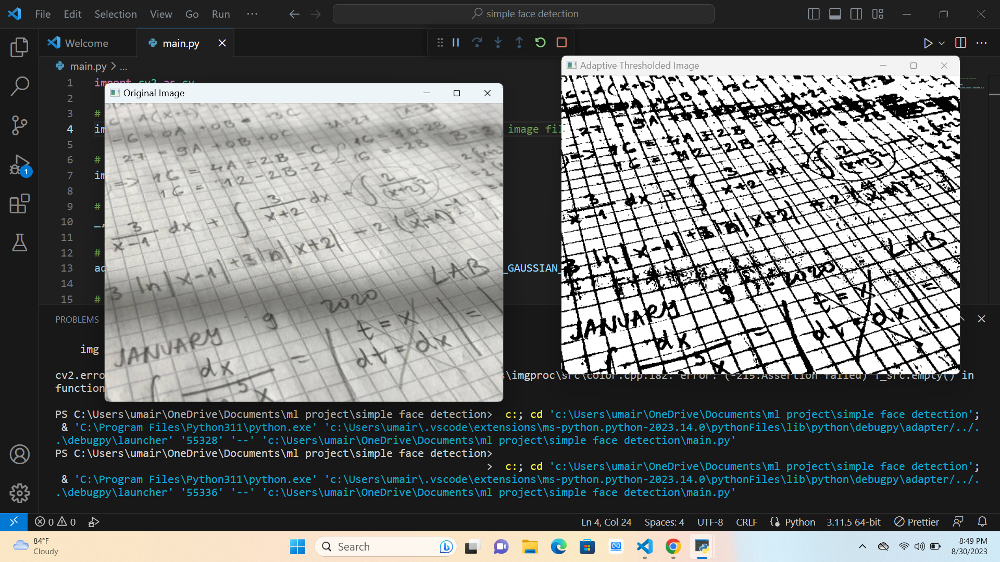
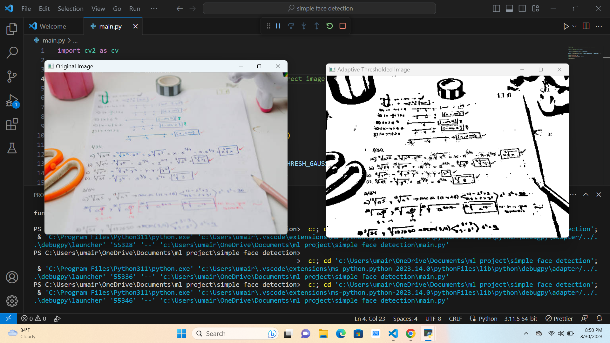
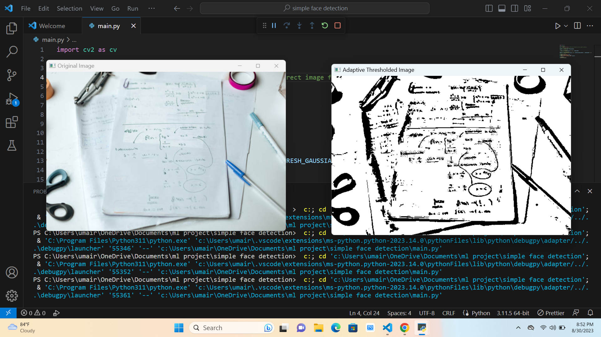

# Text Image Enhancement with Python and OpenCV

## Overview

This project demonstrates how to enhance the readability of text images using Python and the OpenCV library. Text images often suffer from various issues such as poor contrast, noise, and uneven lighting, making it challenging to extract meaningful information. The purpose of this project is to improve the quality of text images to make them more legible and suitable for further analysis or processing.

## Features

- **Image Enhancement**: The project uses OpenCV to perform image enhancement techniques to improve the quality of text images.
- **Thresholding**: Thresholding techniques are applied to convert the text image into a binary format, making text stand out from the background.
- **Adaptive Thresholding**: Adaptive thresholding methods are used to handle variations in lighting and contrast within the image.
- **Readability Improvement**: By applying these techniques, the project aims to enhance the readability of text, even in challenging image conditions.

## Libraries Used

This project relies on the following libraries:

- **OpenCV**: OpenCV is a popular open-source computer vision library for image processing and computer vision tasks.

## How It Works

1. **Image Loading**: The project begins by loading the input text image using OpenCV's `cv.imread` function. Ensure you provide the correct file path for the image you want to process.

2. **Grayscale Conversion**: The loaded image is converted to grayscale using the `cv.cvtColor` function. Grayscale conversion simplifies the image to a single channel, making it easier to apply various enhancement techniques.

3. **Fixed Thresholding**: A fixed threshold is applied using `cv.threshold` to create a binary image. Pixels with intensities below a certain threshold value are set to 0 (black), while pixels above the threshold are set to 255 (white). Adjust the threshold value as needed for your specific image.

4. **Adaptive Thresholding**: To handle variations in lighting and contrast within the image, adaptive thresholding is applied using `cv.adaptiveThreshold`. This technique calculates the threshold for each pixel based on the local neighborhood, resulting in improved readability.

5. **Display Results**: The original image, the result of fixed thresholding, and the result of adaptive thresholding are displayed using `cv.imshow`. This allows you to visually compare the enhancements.

6. **User Interaction**: The script waits for user input with `cv.waitKey(0)` so that you can examine the enhanced images. Close the windows by pressing any key.

7. **Cleanup**: After examining the results, all OpenCV windows are closed using `cv.destroyAllWindows`.

## Usage

To use this project:

1. Install the required libraries, particularly OpenCV.
   
2. Save the text image you want to enhance in the project directory.

3. Update the image file path in the script to point to your image file.

4. Adjust the threshold values and other parameters as needed for your specific image.

5. Run the script. It will display the original image, the result of fixed thresholding, and the result of adaptive thresholding.

6. Examine the results and fine-tune the parameters if necessary to achieve the best readability for your text image.

## Image 

1.  
2.  
3.  
4.  

## Result

1. 
2. 
3. 
4. 

## Contact

- Email : umairh1819@gmail.com
